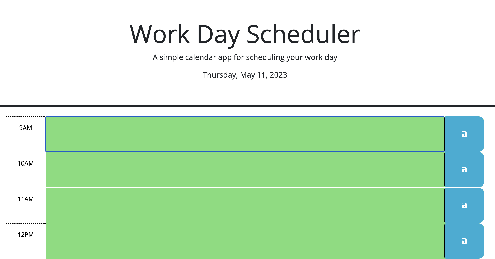
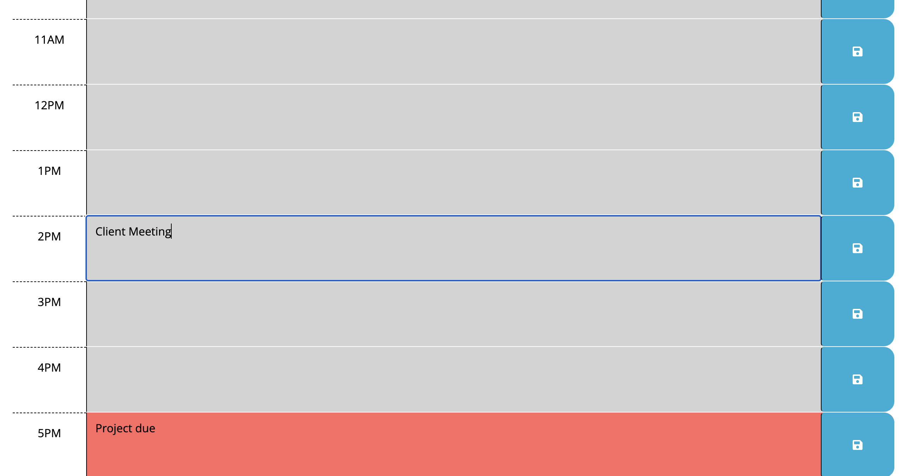

# day-planner
[](code_of_conduct.md)

## The Repository

This repository contains javascript and HTML code refactored to allow a user to save events for each hour of the day in a day planner application. Starter code was provided by Columbia Coding Bootcamp.

---

## Installation

The code may be accessed on [GitHub](https://github.com/choelzli/day-planner) or visiting the site URL (https://choelzli.github.io/day-planner/).

Clone the repo:
```
git clone https://github.com/choelzli/day-planner.git
```
---

## Usage

Upon accessing the webpage, it displays a title, header, the current date, input fields to enter tasks for each hour, and a button to save tasks to local storage.  



As the day passes and you refresh the page, future events that were in green turn to red when present and gray when past.

 

---

## License

Licensed under the MIT license.

---

## Credits

Base code strategies provided by Columbia Coding Bootcamp. Other sources include:
* [The Contributor Covenant](https://www.contributor-covenant.org/)
* [Day.js: Format](https://day.js.org/docs/en/display/format)
* [MDN Web Docs: Loops and iteration](https://developer.mozilla.org/en-US/docs/Web/JavaScript/Guide/Loops_and_iteration)
* [MDN Web Docs: Window: localStorage property](https://developer.mozilla.org/en-US/docs/Web/API/Window/localStorage)
* [README Template](https://github.com/othneildrew/Best-README-Template)
* [Stack Overflow: Getting attribute of a parent node](https://stackoverflow.com/questions/9126264/getting-attribute-of-a-parent-node)
* [Stack Overflow: How to add a class to a given element](https://stackoverflow.com/questions/507138/how-to-add-a-class-to-a-given-element)
* [W3 Schools: jQuery html() Method](https://www.w3schools.com/jquery/html_html.asp)
* [VS Code README](https://github.com/microsoft/vscode/tree/main)